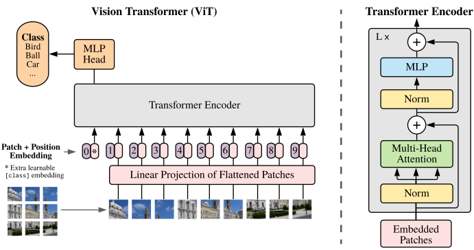
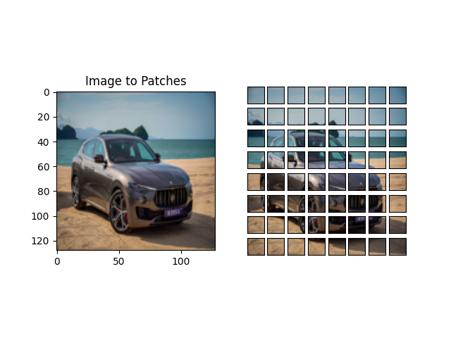

# vision_transformer_from_scratch


This repository was created to help me better understand Vision Transformer. I wrote the explanatory article [here](https://medium.com/@hirok4/explanation-of-vision-transformer-with-implementation-8f098ebc1233). The code is based on [this repository](https://github.com/nerminnuraydogan/vision-transformer/tree/main).

<br></br>

## How to create the environment
You can create the environemt with anaconda.

```bash
conda create -n vit python=3.11
conda activate vit
conda install pytorch torchvision pytorch-cuda=12.1 -c pytorch -c nvidia
pip install -r requirements.txt
```

<br></br>

## How to create vision transformer architecture
You can create vision transformer architecture by running following commands.

```bash
conda activate vit
cd scripts
python vision_transformer.py
```

<br></br>

## How to train vision transformer
You can train vision transformer model by using pretrained model.

```bash
conda activate vit
cd scripts
python train.py
```

<br></br>

## Appendix: Image patches



You can try split an image to image patches by running following commands.

```bash
conda activate vit
cd scripts
python image_to_patches.py
```

<br></br>

## References
- [AN IMAGE IS WORTH 16X16 WORDS: TRANSFORMERS FOR IMAGE RECOGNITION AT SCALE](https://arxiv.org/pdf/2010.11929)
- [Vision Transformers](https://github.com/nerminnuraydogan/vision-transformer/tree/main)
- [The Illustrated Transformer](https://jalammar.github.io/illustrated-transformer/)
